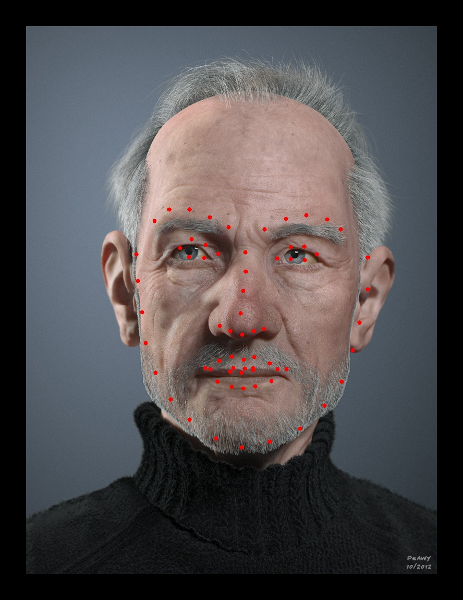

# Facial-landmark-detection

## Example
|            My implementation:            |           DLib reference:           |
| :--------------------------------------: | :---------------------------------: |
|  |  |

## Usage:
- git clone
- pip install -r requirements.txt
- python3 main.py
- send POST request to /facial-landmark-detection with 'image' parameter
- interactive web verison availible at /
- docker container availible at [dockerhub](https://hub.docker.com/repository/docker/empyempt/fld)  

~~~bash
docker pull empyempt/fld:latest
~~~

## Datasets: 
~~[Male and female faces dataset Kaggle](https://www.kaggle.com/ashwingupta3012/male-and-female-faces-dataset/metadata)~~  
[Flickr-Faces-HQ Dataset (FFHQ)](https://github.com/NVlabs/ffhq-dataset)  

Exact images and .csv files can be pulled via [DVC](https://dvc.org/)
~~~bash
dvc pull
~~~

## Model  
CNN implemented in Keras (exact architecture can be found in model.py)

## Landmarks:  
-   Jaw Points = 0–16
-   Right Brow Points = 17–21
-   Left Brow Points = 22–26
-   Nose Points = 27–35
-   Right Eye Points = 36–41
-   Left Eye Points = 42–47
-   Mouth Points = 48–60
-   Lips Points = 61–67

## Output
Model outputs tensor with shape (136, ) where for (k in 0->67)  
- [k] is X for landmark k
- [k+1] is Y for landmark k

## Training and tinkering

You can run predictions, train new models on existing dataset and create new datasets interactively in provided Notebook (example.ipynb)
